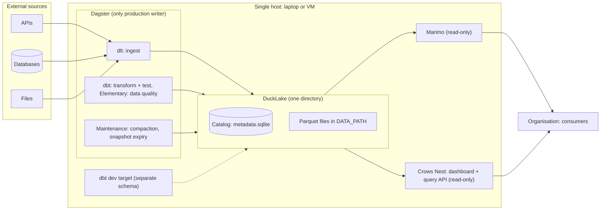
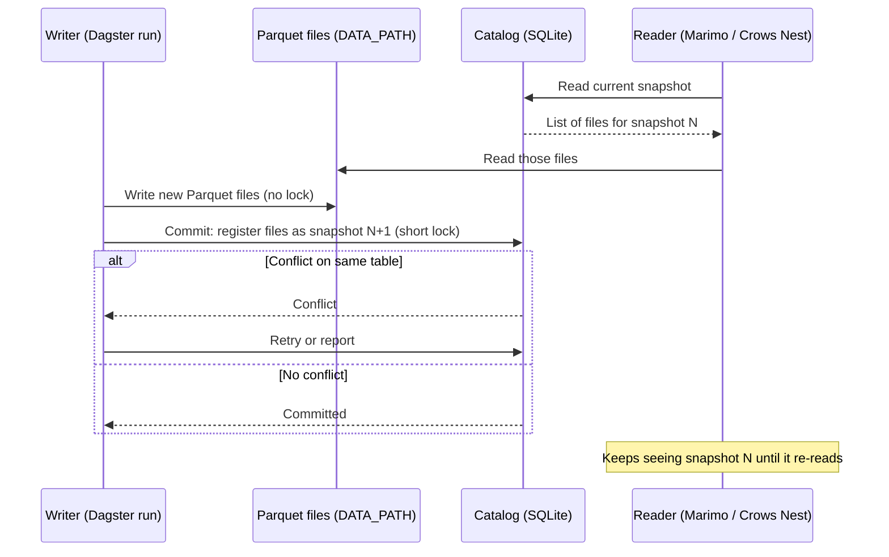
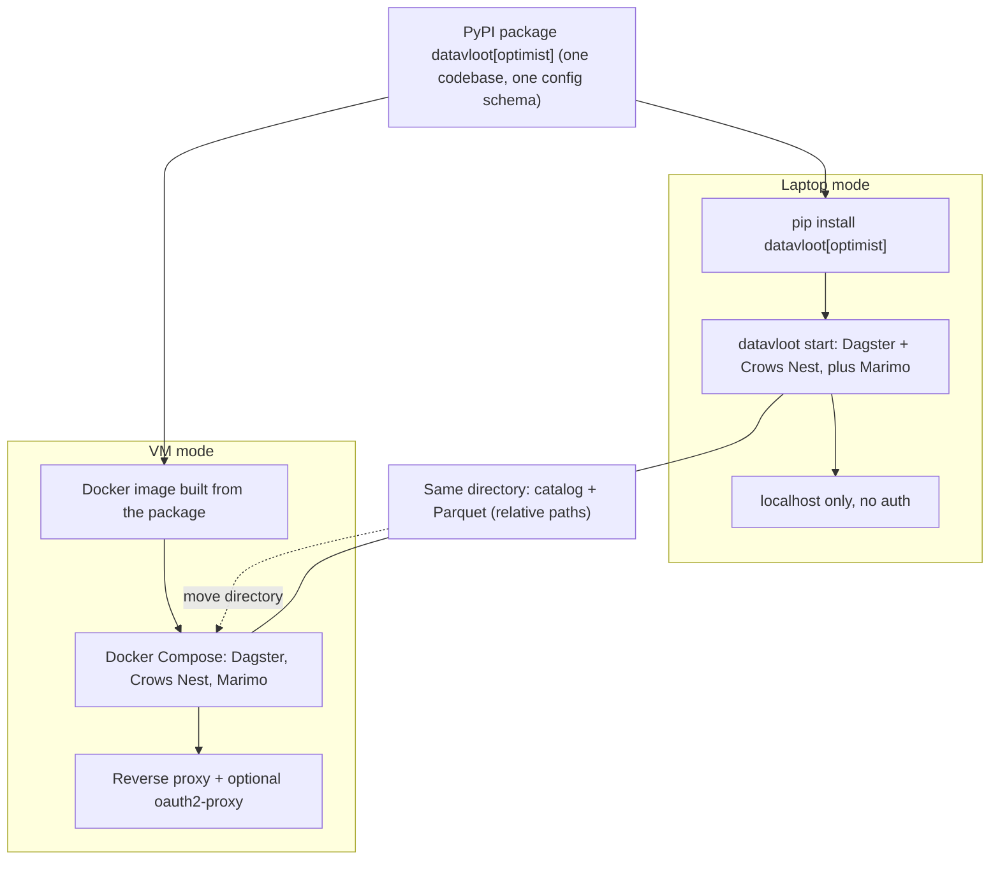
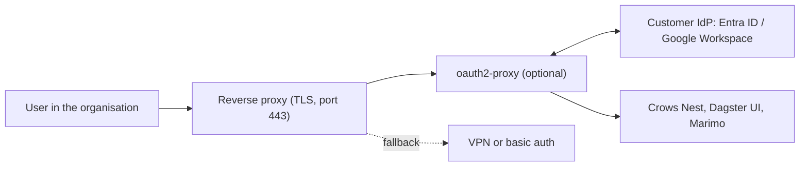
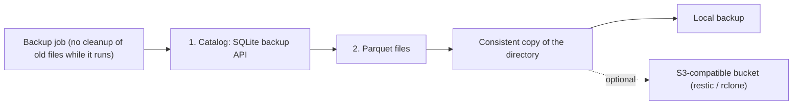
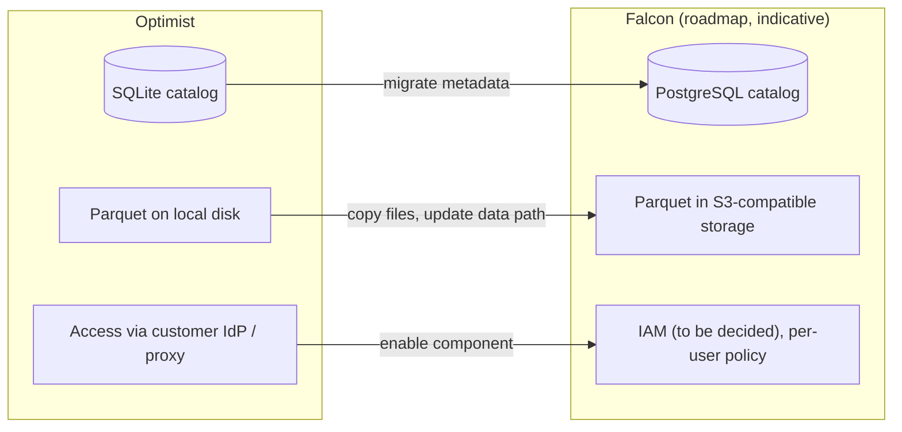

# Optimist architecture (single node)

> **Status: proposed.** This describes the target architecture, not the current implementation: scaffolded projects currently write to a single DuckDB file, without a DuckLake catalog or maintenance jobs. The decision is recorded in an ADR (to be added).

The Optimist is the single-node tier, aimed at an organisation with a data team of one: technically multi-client, organisationally single-writer. Everything lives on one host; the full state is one directory.

## 1. Component overview

## 2. How a write works

The heavy work (writing Parquet) happens outside the catalog. The catalog lock is held only for the short metadata commit, which is why several local processes can write side by side.

## 3. Two ways of running, one artifact

## 4. Access on the VM

Access to the site, not access policy on data. Per-user data authorisation belongs to Falcon. The Dagster UI and Marimo have no authentication of their own, so every service sits behind the proxy.

## 5. Backup

Copy the catalog first, then the files. Parquet files are never modified after they are written, so every file the copied catalog refers to already exists; files written after the catalog copy are harmless extras. Cleanup of old files must not run during the backup, or it can delete a file the copied catalog still references. Writers can keep running.

## 6. Upgrade path to Falcon

Swap catalog and storage; project code (dlt, dbt, Dagster assets) stays the same. Falcon is on the roadmap; its components below are indicative, not decided.

## Component summary

| Component | Optimist | Falcon (indicative) |
|---|---|---|
| Ingest | dlt | dlt |
| Catalog | DuckLake + SQLite | DuckLake + PostgreSQL |
| Data storage | Parquet on local disk | Parquet in S3-compatible storage |
| Transform & test | dbt | dbt |
| Data quality | Elementary | Elementary |
| Orchestration | Dagster, concurrency limit on writing jobs | Dagster, multiple code locations |
| Writers | Multiple local processes, one production path | Multiple users and machines |
| Dashboard | Crows Nest, read-only | Crows Nest |
| Analysis | Marimo, read-only | Marimo per user with own rights |
| Access | Customer IdP via oauth2-proxy, or VPN / basic auth | IAM (to be decided), per-user policy |
| Secrets | `.env` on the host | Secrets management |
| Backup | Copy of the directory, optional off-site bucket | PostgreSQL dump + object storage versioning |
| Runtime | Laptop (pip) or single VM (Compose) | Compose or Kubernetes |
