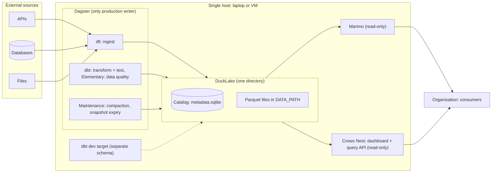
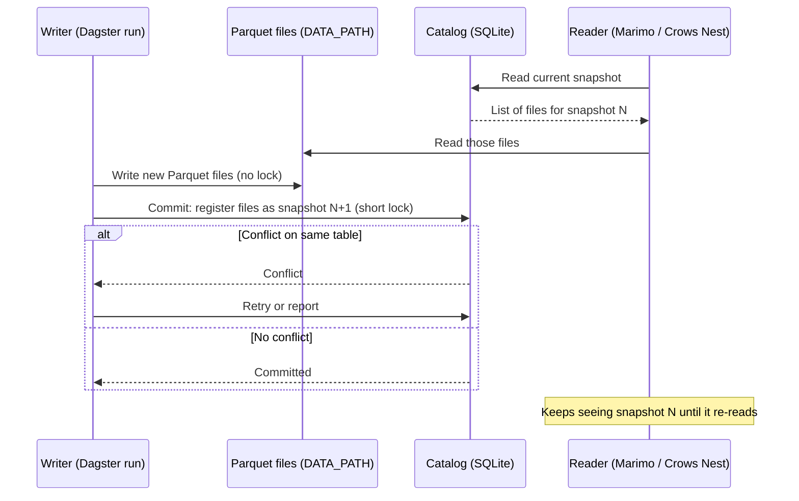
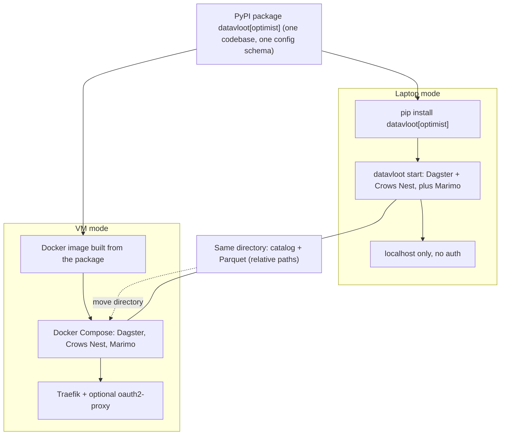
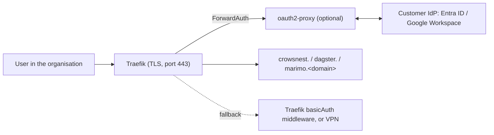
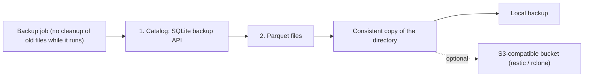
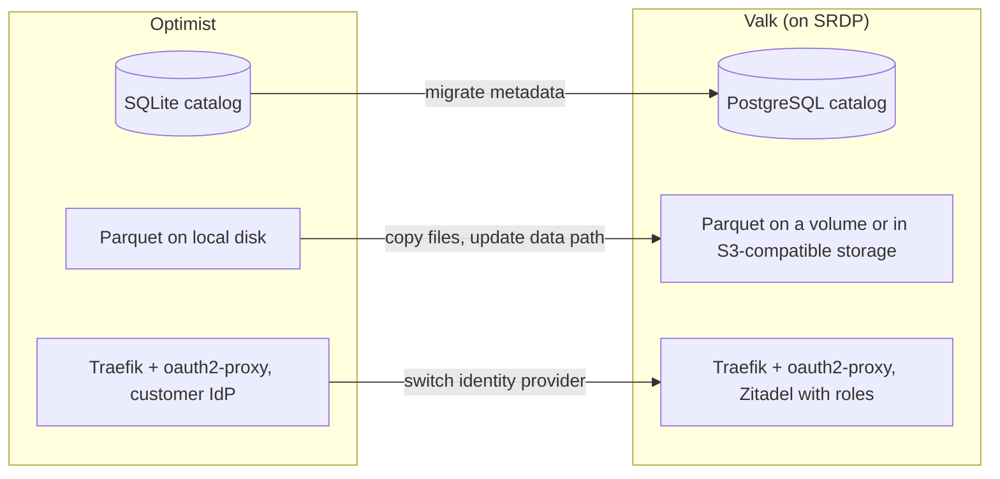

# Optimist architecture (single node)

> **Status: proposed.** This describes the target architecture, not the current implementation: scaffolded projects currently write to a single DuckDB file, without a DuckLake catalog or maintenance jobs. The decision is recorded in an ADR (to be added).

The Optimist is the single-node vessel, aimed at an organisation with a data team of one: technically multi-client, organisationally single-writer. Everything lives on one host; the full state is one directory. The next vessel, the Valk, runs the same project on an SRDP stack (see `docs/valk.md`, not yet merged); the Optimist's VM mode deliberately uses the same building blocks so that moving up is adding services, not rebuilding.

## 1. Component overview

## 2. How a write works

The heavy work (writing Parquet) happens outside the catalog. The catalog lock is held only for the short metadata commit, which is why several local processes can write side by side.

## 3. Two ways of running, one artifact

## 4. Access on the VM

Access to the site, not access policy on data; per-user roles belong to the Valk. The Dagster UI and Marimo have no authentication of their own, so every service sits behind Traefik.

The setup mirrors the Valk: same Traefik static configuration (Docker provider, `exposedByDefault: false`, HTTP to HTTPS redirect, dashboard off), same hostnames (`crowsnest.`, `dagster.`, `marimo.<domain>`) and the same ForwardAuth middleware to oauth2-proxy. The difference is the identity provider: the customer's own IdP instead of Zitadel. Without an IdP, Traefik's built-in `basicAuth` middleware replaces oauth2-proxy. TLS comes from Let's Encrypt through Traefik's ACME resolver.

Open: the Crows Nest validates access tokens itself rather than trusting the proxy's headers. Pointing its OIDC mode at the customer's IdP, with `reader` as default role, is the likely route; it has not been tested against Entra ID or Google Workspace.

## 5. Backup

Copy the catalog first, then the files. Parquet files are never modified after they are written, so every file the copied catalog refers to already exists; files written after the catalog copy are harmless extras. Cleanup of old files must not run during the backup, or it can delete a file the copied catalog still references. Writers can keep running.

## 6. Upgrade path to the Valk

Set `vessel: valk` in `datavloot.yml`, move the catalog and the data; project code (dlt, dbt, Dagster assets) stays the same. The Valk is built as a client project on SRDP, which supplies Traefik, oauth2-proxy with Zitadel, and the Postgres that holds the DuckLake catalog.

## Component summary

| Component | Optimist | Valk |
|---|---|---|
| Ingest | dlt | dlt |
| Catalog | DuckLake + SQLite | DuckLake + PostgreSQL |
| Data storage | Parquet on local disk | Parquet on a volume or in S3-compatible storage |
| Transform & test | dbt | dbt |
| Data quality | Elementary | Elementary |
| Orchestration | Dagster, concurrency limit on writing jobs | Dagster webserver, daemon and code server as separate containers |
| Writers | Multiple local processes, one production path | One project per stack, writes through Dagster |
| Dashboard | Crows Nest, read-only | Crows Nest, roles `reader` / `writer` / `admin` |
| Analysis | Marimo, read-only | Marimo (SRDP's service) |
| Reverse proxy | Traefik (VM mode only) | Traefik (from SRDP) |
| Access | oauth2-proxy with the customer's IdP, or Traefik basic auth | oauth2-proxy with Zitadel, per-user roles |
| Secrets | `.env` on the host | `.env` in `deploy/valk/` |
| Backup | Copy of the directory, optional off-site bucket | Not yet defined |
| Runtime | Laptop (pip) or single VM (Compose) | Docker Compose: SRDP stack plus the project's overlay |
