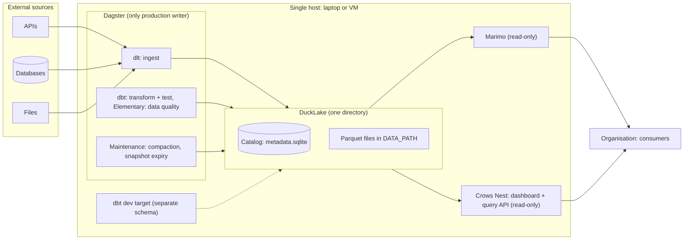
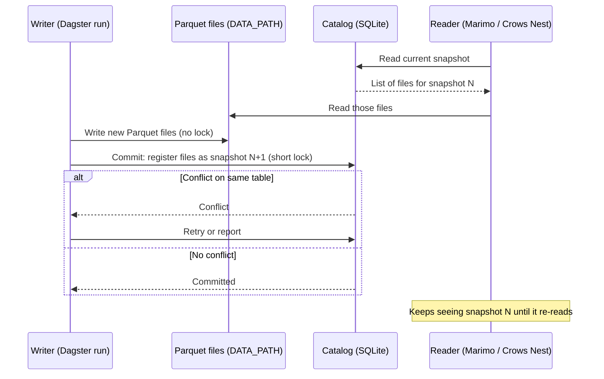
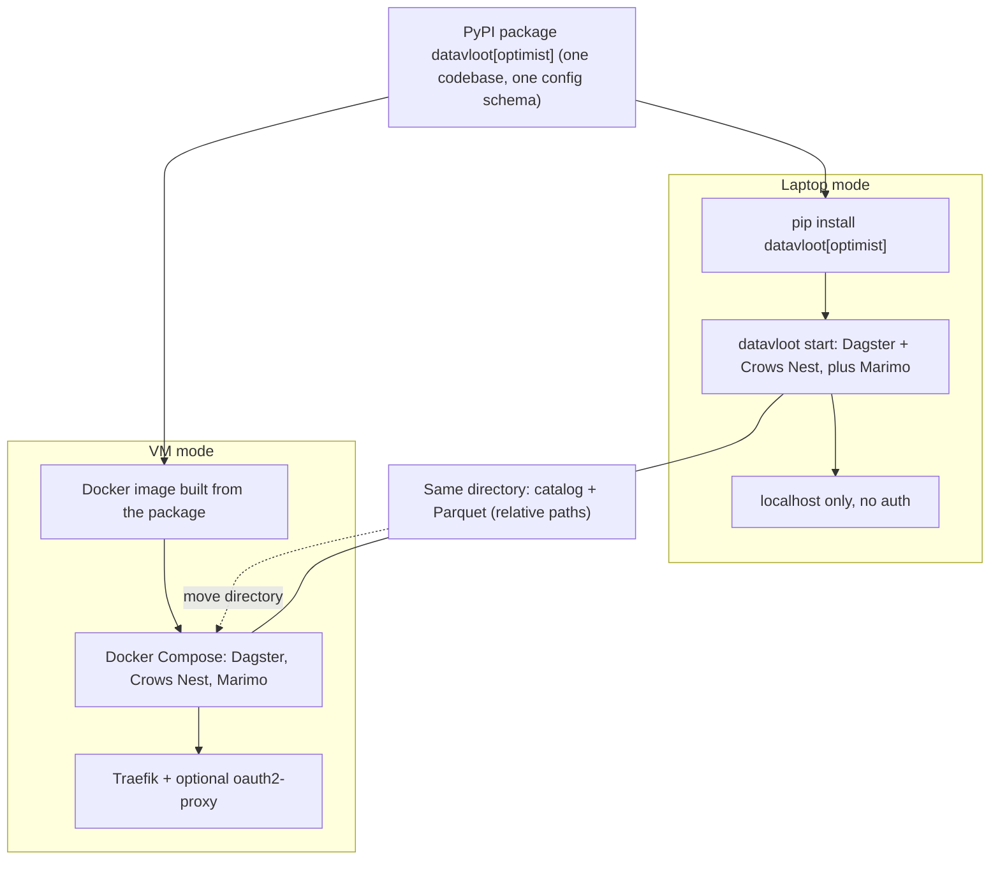
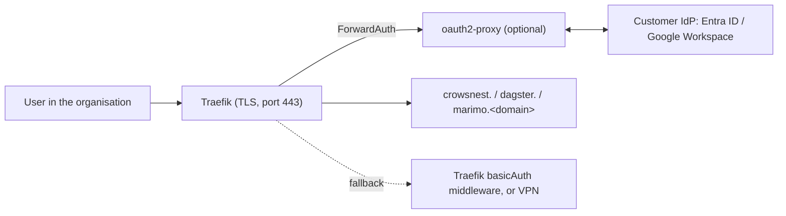
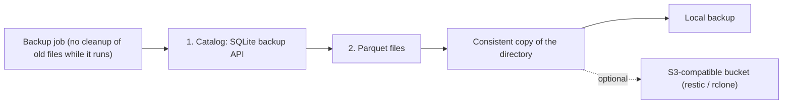

# Optimist architecture (single node)

> **Status: proposed.** This describes the target architecture, not the current implementation: scaffolded projects currently write to a single DuckDB file, without a DuckLake catalog or maintenance jobs. The reasoning is in [ADR 0001](adr/0001-optimist-single-node-single-writer.md).

The Optimist is the single-node vessel, aimed at an organisation with a data team of one: technically multi-client, organisationally single-writer. Everything lives on one host; the full state is one directory.

## 1. Component overview

## 2. How a write works

The heavy work (writing Parquet) happens outside the catalog. The catalog lock is held only for the short metadata commit, which is why several local processes can write side by side.

## 3. Two ways of running, one artifact

## 4. Access on the VM

Access to the site, not access policy on data: whoever is let in sees everything. The Dagster UI and Marimo have no authentication of their own, so every service sits behind Traefik and is reachable only through it.

Traefik runs with the Docker provider (`exposedByDefault: false`), redirects HTTP to HTTPS and has its dashboard off; each service gets its own hostname (`crowsnest.`, `dagster.`, `marimo.<domain>`). A ForwardAuth middleware sends every request to oauth2-proxy, connected to the customer's own IdP, so one sign-in covers all three. Without an IdP, Traefik's built-in `basicAuth` middleware replaces oauth2-proxy. TLS comes from Let's Encrypt through Traefik's ACME resolver.

The Crows Nest's own token auth (`CROWSNEST_AUTH_TOKEN`) stays off behind the proxy, so users are not asked twice. That is only safe because the Crows Nest is not reachable except through Traefik.

## 5. Backup

Copy the catalog first, then the files. Parquet files are never modified after they are written, so every file the copied catalog refers to already exists; files written after the catalog copy are harmless extras. Cleanup of old files must not run during the backup, or it can delete a file the copied catalog still references. Writers can keep running.

## Component summary

| Component | Optimist |
|---|---|
| Ingest | dlt |
| Catalog | DuckLake + SQLite |
| Data storage | Parquet on local disk, under the project directory |
| Transform & test | dbt |
| Data quality | Elementary |
| Orchestration | Dagster, concurrency limit on writing jobs |
| Writers | Multiple local processes, one production path |
| Dashboard | Crows Nest, read-only |
| Analysis | Marimo, read-only |
| Reverse proxy | Traefik (VM mode only) |
| Access | oauth2-proxy with the customer's IdP, or Traefik basic auth |
| Secrets | `.env` on the host |
| Backup | Copy of the directory, optional off-site bucket |
| Runtime | Laptop (pip) or single VM (Compose) |
